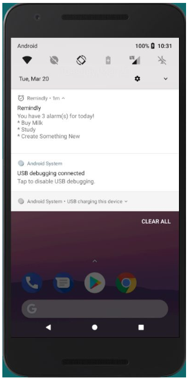
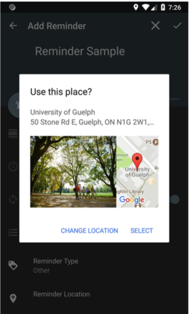
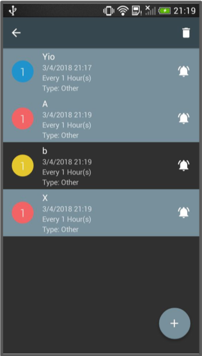
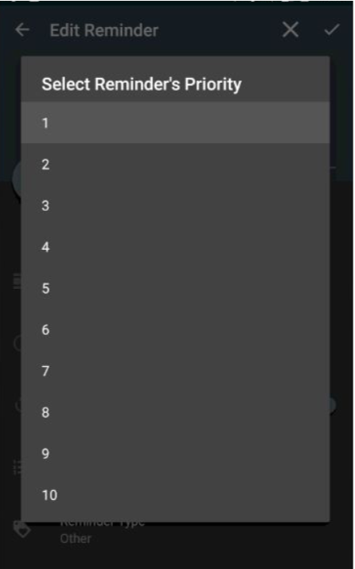
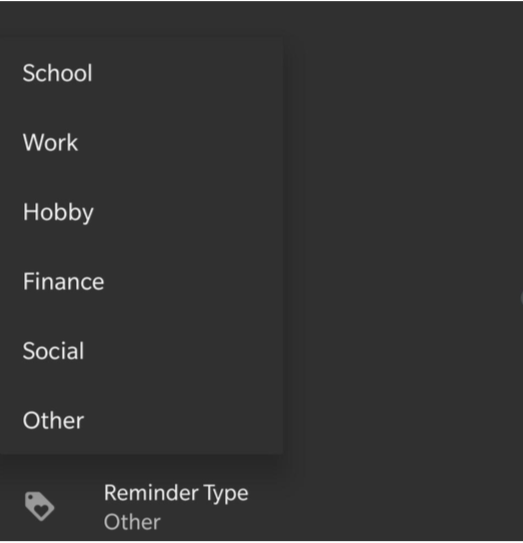
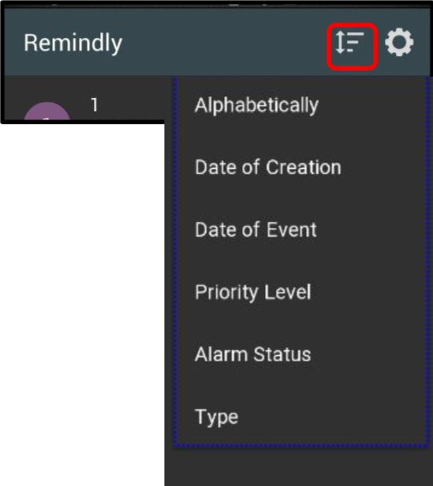

# Remindly V2 #

For our course term project, we were tasked with finding an open-source app and improving it over the course of the semester. My team and I worked in an Agile Environment where we did 2 week sprints. 

    Other Team Members
    - Chenxingyu Chen (Alex)
    - Liam Jones
    - Julian Jarrin
    - Michal Chorobik

   Features we added
   ------------------------
   
   Daily Agenda
   -------------
   
   
   Location
   -------------
   
   
   Multiselect
   -------------
   
   
   Priority
   -------------
   
   
   Reminder Types
   -------------
   
   
   Sorting
   -------------
   

# Original App #
Android reminder app

Features
-------

- Material Design UI
- Repeating reminders. Set intervals in minutes, hours, days, weeks and months
- Completely free and ad-free

License
-------

    Copyright 2015 Blanyal D'Souza

    Licensed under the Apache License, Version 2.0 (the "License");
    you may not use this file except in compliance with the License.
    You may obtain a copy of the License at

       http://www.apache.org/licenses/LICENSE-2.0

    Unless required by applicable law or agreed to in writing, software
    distributed under the License is distributed on an "AS IS" BASIS,
    WITHOUT WARRANTIES OR CONDITIONS OF ANY KIND, either express or implied.
    See the License for the specific language governing permissions and
    limitations under the License.
 
